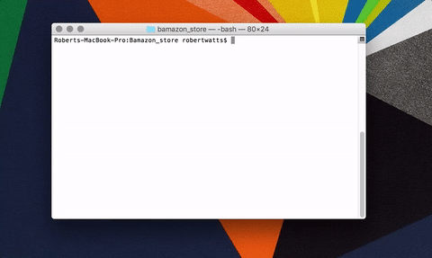
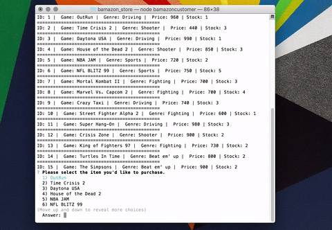
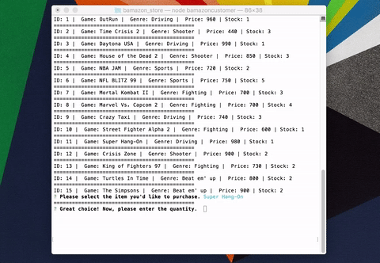

# Bamazon Store: a shoping portal with SQL and Node. 

The Bamazon store (no relation to the eCommerce beast, of course) is shopping portal for old-timey arcade machines. Fellow nerds can use this node portal to see the store inventory and purchase games.

Here is a brief rundown of how the app works. 

Let's go ahead and run the app in the terminal:

Hit 'Enter', and we see the store's stock, linked to a MySQL database. All we need to do is enter the ID number of the game and hit enter. Let's go with the classic racer, Super Hang-On. 

Next, we are asked to enter the quantity. Perhaps if I was a reseller, I could buy one for myself, spruce up a second machine, and sell it to someone. But today, I'd just like one. 

Great, our purchase went though...

Look at Crisis Zone, and we can see that the changes have been made in the database. 

And we're all set. Thanks for taking a look!

